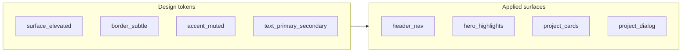

# Staff / Principal engineer UI/UX upgrade

## Direction

**Principal-level signals** in product design are usually: high legibility, predictable layout, muted color with one disciplined accent, minimal gimmicky motion, and copy that states scope and impact plainly. Your site currently mixes that with playful cues (translucent candy cards, `scale(1.05)` hovers, purple primary buttons, emoji theme toggle, footer initials).

The upgrade should be **token-driven** so Space and Garden both feel like two moods of the same “studio,” not two different brands.

## 1. Typography (first impression + lasting read)

- **Change the font stack** in [`index.html`](index.html) (Google Fonts link): move from `Roboto` + `Open Sans` to a pairing that reads “technical + editorial.” Strong options that stay on Google Fonts CDN:
  - **IBM Plex Sans** (body/UI) + **IBM Plex Serif** or **Source Serif 4** (display/hero only), or
  - **Inter** (body) + **Source Serif 4** (hero `h1` only).
- **Apply roles in [`css/styles.css`](css/styles.css)**:
  - Body: 400/500, slightly increased `line-height` (1.6–1.65) for long-form comfort.
  - `h1` / section titles: serif or tighter sans with controlled `letter-spacing` (avoid amateur “wide tracking everywhere”).
  - **Remove or relax** `white-space: nowrap` on [`h1, h2, h3`](css/styles.css) (lines ~237–245) so titles wrap cleanly on small viewports—nowrap fights a professional responsive layout.

## 2. Color system (replace “playful default” with “disciplined accent”)

Extend [`css/styles.css`](css/styles.css) theme blocks (`:root`, `[data-theme="space"]`, `[data-theme="garden"]`) with explicit tokens, e.g.:

- `--surface-elevated`, `--border-subtle`, `--text-secondary`, `--accent`, `--accent-hover`
- **Space**: deep neutral background (keep starfield readable); **accent** = cool steel blue or muted teal—not purple; links aligned to accent.
- **Garden**: desaturate the page background slightly so it feels “calm outdoor studio” rather than bright poster; same accent family shifted for contrast on green.

Then **rewire** existing consumers:

- **CTAs** (`.cta-primary`, `.cta-secondary` ~lines 672+): primary = solid accent or **outline + fill on hover**; avoid loud purple blocks.
- **Highlight cards** (`.highlight`): swap frosted blobs for **bordered panels** (`1px` + `--border-subtle`) and subtle shadow or none.
- **Project cards** ([`.project`](css/styles.css) ~247–278): replace `#e95ea371` / `#0973e971` with `background: var(--surface-elevated)` + border; hover = **small translate + border/ shadow change**, not `transform: scale(1.05)` (reads as consumer-app playful).
- **Project dialog** ([`.project-dialog__panel`](css/styles.css) ~310+): align panel background to `--surface-elevated` / theme tokens instead of hard-coded `rgb(34, 34, 38)` / `rgb(145 180 150)` so it matches the rest of the system.

## 3. Chrome: header, theme toggle, footer

- **Navbar** ([`header`](css/styles.css), [`.navbar`](css/styles.css)): optional `backdrop-filter: blur(8–12px)` + slightly stronger bottom border using `--border-subtle`; reduce “pill hover” contrast if it feels toy-like.
- **Theme toggle** ([`js/app.js`](js/app.js) lines 23–27): replace emoji (`🦸` / `🚀`) with **text** (“Garden” / “Space”) or neutral SVG/CSS icon so the control reads as a preference, not a game. Keep `aria-label` precise.
- **Footer** ([`index.html`](index.html) ~127): change `© 2026 ME` to full name or “Marwan Elgendy” for a professional signature line.

## 4. Motion and reduced-motion

- Tone down [`contentSectionBloom`](css/styles.css) / [`scale-in`](css/styles.css) if they feel bouncy; prefer opacity + short distance.
- Ensure **all new transitions** sit behind `@media (prefers-reduced-motion: reduce)` (you already have patterns for section bloom and project-dialog animations).

## 5. Copy (HTML + meta): align words with Staff/Principal framing

Light edits in [`index.html`](index.html) only where it improves signal:

- `<title>` and `<meta name="description">`: include senior IC scope (architecture, technical leadership, systems)—without buzzword soup.
- Hero: one line for **role level** (e.g. positioning as staff/principal scope) and tagline focused on **systems, reliability, and delivery**—still honest to your resume.
- Section headings (`Playground` / `Portfolio`): optional subtler labels (“Experiments,” “Selected experience”) if you want less “playground” tone.

## 6. Spaceman (keep character, align palette)

In [`css/spaceman.css`](css/spaceman.css), adjust **CSS variables** (`--spaceman-bubble-*`, `--spaceman-cursor-color`, etc.) so speech bubbles and accents use the same **`--accent`** family as the main UI. No JS changes required unless you want copy tweaks in [`data/spaceman.json`](data/spaceman.json) (optional, separate from layout).

## Files to touch

| File | Role |
|------|------|
| [`index.html`](index.html) | Font link, hero/meta/footer copy |
| [`css/styles.css`](css/styles.css) | Tokens, typography, nav/hero/CTA/cards/dialog, motion tweaks |
| [`js/app.js`](js/app.js) | Theme toggle label (remove emoji) |
| [`css/spaceman.css`](css/spaceman.css) | Bubble/accent variables aligned to tokens |

## Out of scope (unless you explicitly want them)

- Replacing canvas starfield/rain or removing Garden theme
- Full rewrite of spaceman messages
- Adding a third “resume-only” theme

## Manual verification

- Both themes: contrast for text, links, and focus rings (keyboard).
- Mobile: headings wrap; dialogs and cards remain tappable with clear focus.
- `prefers-reduced-motion`: no distracting motion.
