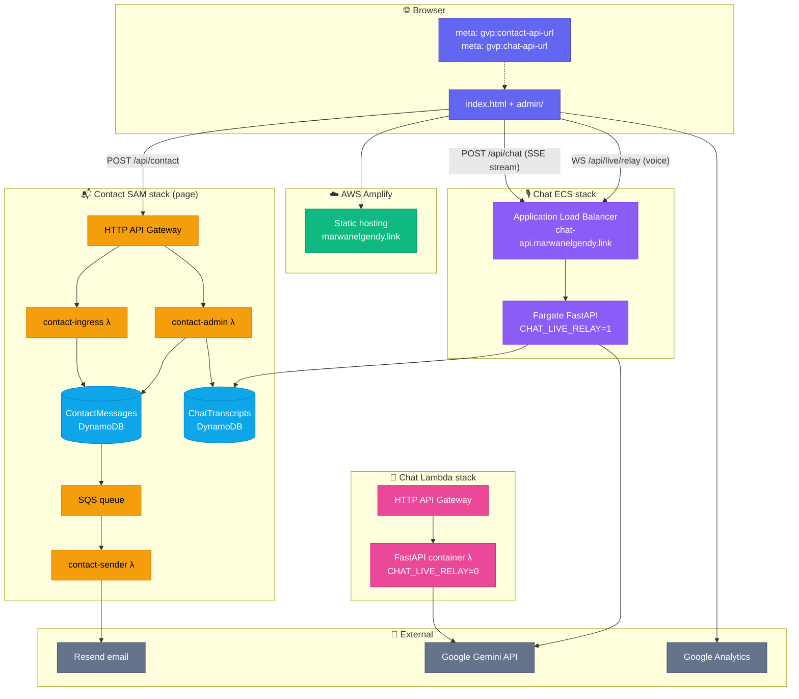
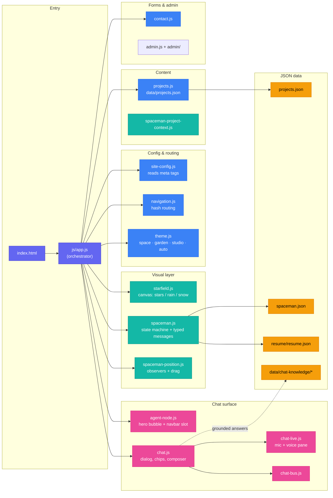
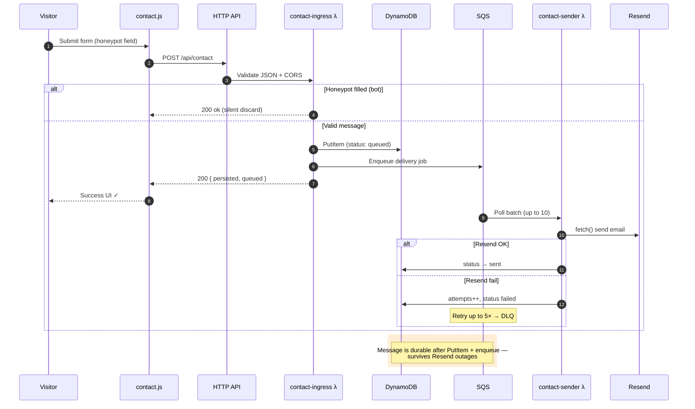
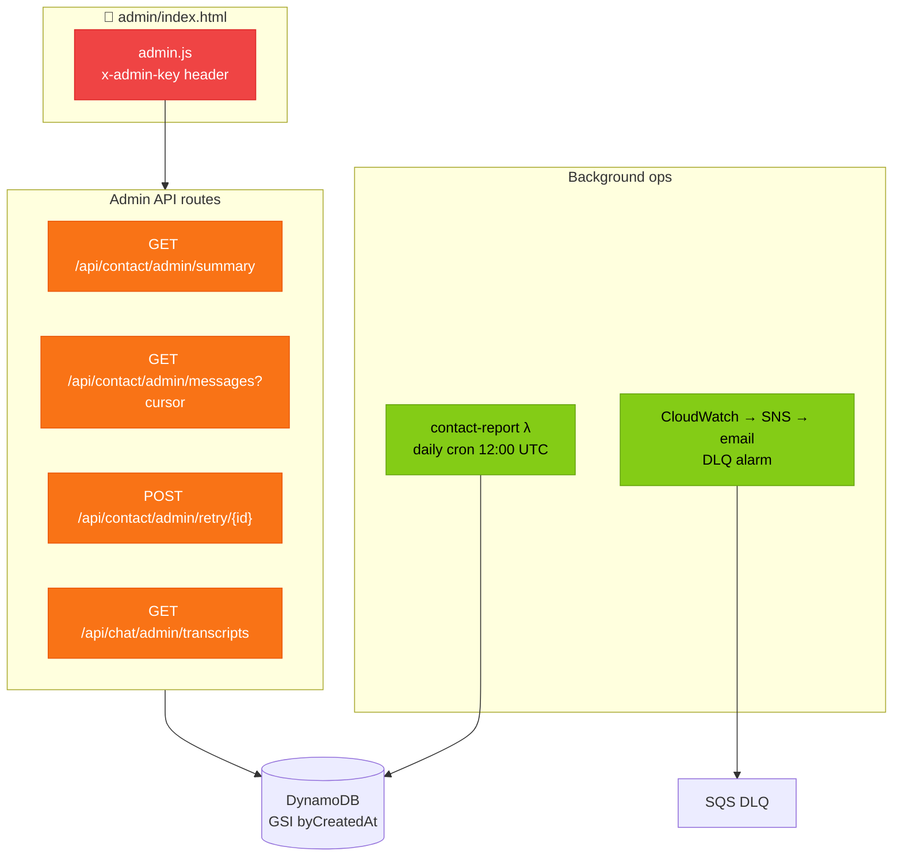
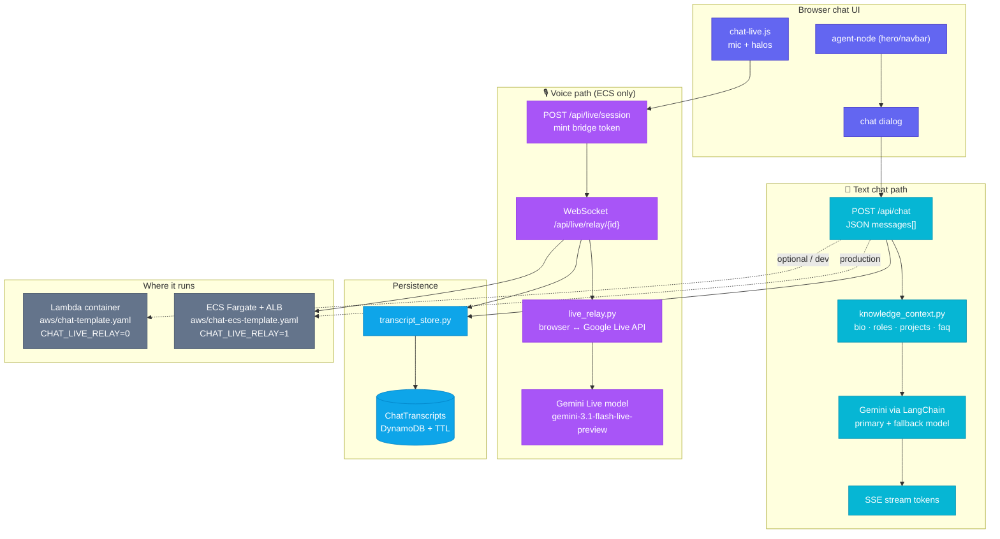
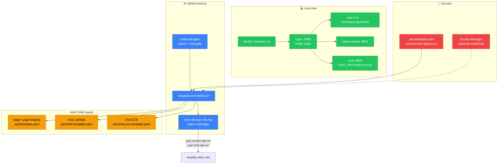
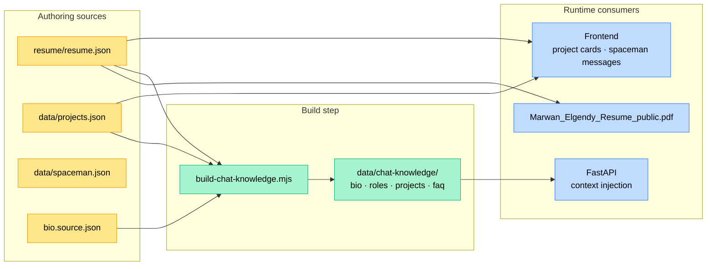

# GVP architecture

Architecture reference for **Marwan Elgendy's portfolio** (`gvp`): a static site on **AWS Amplify**, a durable **contact pipeline** (SAM), and a **Gemini-backed chat API** (Lambda for text, ECS + ALB for voice WebSockets).

Diagrams use [Mermaid](https://mermaid.js.org/). They render on GitHub, in many IDEs, and in viewers that support fenced `mermaid` blocks.

**Related docs:** [`README.md`](../README.md) (run/deploy), [`CLAUDE.md`](../CLAUDE.md) (module map), [`docs/production-readiness/`](production-readiness/README.md) (release checklists).

---

## Table of contents

1. [System overview](#1-system-overview)
2. [Frontend (static site)](#2-frontend-static-site)
3. [Contact pipeline](#3-contact-pipeline)
4. [Chat (text + voice)](#4-chat-text--voice)
5. [Deployment topology](#5-deployment-topology)
6. [Data and assets](#6-data-and-assets)
7. [Strengths and constraints](#7-strengths-and-constraints)
8. [Key file map](#8-key-file-map)

---

## 1. System overview

The browser loads static HTML/CSS/JS from Amplify. API base URLs come from `<meta>` tags (patched after deploy by `scripts/sync-site-api-urls.mjs`). Contact and chat admin share one HTTP API on the **contact SAM stack**; chat traffic for production text and all voice goes to **ECS behind an ALB**.

### Design choice: split chat hosting

| Path | Host | Why |
|------|------|-----|
| **Text** (`POST /api/chat`, SSE) | ECS + ALB (prod) or Lambda (optional / dev) | Streaming HTTP; Lambda works but ECS is the primary prod host when voice is required |
| **Voice** (`POST /api/live/session`, `WS /api/live/relay/{id}`) | **ECS + ALB only** | API Gateway HTTP API cannot upgrade browser WebSockets for Gemini Live relay |

Contact admin and chat transcript admin routes live on the **same** contact HTTP API and use the same `x-admin-key` (`ADMIN_API_KEY`).

---

## 2. Frontend (static site)

No bundler: ES modules from `js/app.js`, theme via `data-theme` on `<html>`, hash routing (`#home`, `#playground`, `#portfolio`).

### Boot order (`app.js`)

1. `initAnalytics()` — gtag; virtual `page_view` on navigation
2. `bindOutboundTracking()` — `[data-track]` elements
3. `initTheme()` — `localStorage` key `gvp-theme`
4. `initStarfield()` — canvas background
5. `initContactForm()` — contact dialog
6. `initSpaceman()` — character + message cycle from `/data/spaceman.json` + resume merge
7. `initSpacemanPosition()` — layout observers
8. `initChat()` + `initAgentNode()` — hero/navbar chat + full dialog
9. `initNavigation()` — hash routes; hooks spaceman state
10. `loadProjects()` / `renderProjects()` — `data/projects.json`
11. `initSpacemanProjectContext()` — playground/portfolio card context

### Themes

| Preference | Resolved theme | Canvas / scene |
|------------|----------------|----------------|
| `space` | Space | 3D starfield, motion streaks |
| `garden` | Garden | Rain + DOM garden scene (trees, ocean) |
| `studio` | Studio | Paper-like, low distraction |
| `auto` | `space` or `garden` | Follows `prefers-color-scheme` |

### API URL resolution (`site-config.js`)

- `gvp:contact-api-url` → `contactApiUrl` (local fallback: `/api/contact`)
- `gvp:chat-api-url` → `chatApiUrl` (local fallback: `/api/chat`)
- Also exposed as `window.__CONTACT_API_URL__` and `window.__CHAT_API_URL__` for admin

---

## 3. Contact pipeline

**Success** = message persisted in DynamoDB and enqueued before the UI shows success. Delivery is async via SQS + sender Lambda + Resend.

### Submit flow

### SAM resources (`aws/template.yaml`)

| Resource | Role |
|----------|------|
| `ContactApi` | HTTP API, CORS, throttling (stricter on admin routes) |
| `ContactMessagesTable` | Primary store; GSI `byCreatedAt` (`listPk` + `createdAt`) |
| `ChatTranscriptsTable` | Chat logs; TTL on `expiresAt`; same GSI pattern |
| `ContactDeliveryQueue` | Async delivery; redrive to DLQ after 5 receives |
| `ContactIngressFunction` | `POST /api/contact` |
| `ContactSenderFunction` | SQS trigger → Resend |
| `ContactFailureReportFunction` | Daily cron → email summary of failures |
| `ContactAdminFunction` | Admin + chat transcript admin routes |
| `ContactDlqAlarm` | SNS → `ALARM_EMAIL` when DLQ has messages |

### Admin surface

**Contact admin routes:** `summary`, `messages` (paginated `?limit` + `?cursor`), `messages/{id}`, `health`, `retry/{id}`, `suppress-report`.

**Chat admin routes (same API):** `transcripts`, `transcripts/{id}`, `note`, `reviewed`, `transcripts/summary`.

---

## 4. Chat (text + voice)

FastAPI app in `docker/chat/app/` (same image for Lambda and ECS). Knowledge from `data/chat-knowledge/` (built by `scripts/build-chat-knowledge.mjs`).

### Models (defaults in SAM)

| Use | Parameter / env | Default |
|-----|-----------------|---------|
| Text primary | `GEMINI_MODEL` | `gemini-3.1-flash-lite` |
| Text fallback | `GEMINI_FALLBACK_MODEL` | `gemma-4-26b-a4b-it` |
| Live voice | `GEMINI_LIVE_MODEL` / `CHAT_VOICE_MODEL` | `gemini-3.1-flash-live-preview` |

### Voice behavior

- Mic UI is **always** in the frontend (no feature flag).
- `CHAT_LIVE_RELAY=1` on ECS: server relays browser WebSocket ↔ Google Live.
- `CHAT_LIVE_RELAY=0` on Lambda: text works; voice fails at network level (browser may see 1011 on execute-api hosts).
- Optional `CHAT_LIVE_VOICE_STRICT=1`: `POST /api/live/session` returns **503** when relay is off.

### Local Docker (single origin)

`docker compose up` → nginx `:8080` serves static files and proxies:

| Path | Upstream |
|------|----------|
| `/` | Repo root (static) |
| `/api/contact` | `mock-contact:8001` |
| `/api/chat`, `/api/live/*` | `chat:8000` (`CHAT_PROVIDER=mock` by default) |

See [`docker/nginx.conf`](../docker/nginx.conf) for WebSocket upgrade headers on live routes.

---

## 5. Deployment topology

### Deploy environments

| Target | Contact stack | Chat (typical prod) | Meta sync |
|--------|---------------|---------------------|-----------|
| `prod` | `SAM_STACK_NAME` → `page` | ECS ALB → e.g. `chat-api.marwanelgendy.link` | `CHAT_PROD_CHAT_API_URL` or ALB auto-discover |
| `stage` | `SAM_STACK_NAME_STAGE` → `page-staging` | Same pattern, stage suffix | `CHAT_STAGE_CHAT_API_URL` or Lambda `ChatPostApiUrl` |

**Entrypoint:** `bash scripts/integrate-and-deploy.sh [prod|stage]`

**Voice ECS bootstrap** (`CHAT_VOICE_ECS_BOOTSTRAP=1`, default): auto ECR repo `gvp-chat`, VPC/subnet discovery, stack names `gvp-chat-ecs-{stage,prod}`. Opt out: `CHAT_VOICE_ECS_BOOTSTRAP=0` (Lambda-only chat; voice will not work).

**Secrets:** copy from [`secrets.example/`](../secrets.example/README.md) → `.secrets/deploy.env` (+ optional `chat-deploy.env`). CI uses repository secrets with the same names.

**HTML sync:** `node scripts/sync-site-api-urls.mjs` patches `<meta name="gvp:contact-api-url">` and `<meta name="gvp:chat-api-url">` in `index.html` and `admin/index.html`.

---

## 6. Data and assets

**Site images:** `data/projects.json` references `.webp` / `.jpeg` assets at repo root (e.g. `ibm.webp`, `rpi.jpg`). **Resume link:** `resume/Marwan_Elgendy_Resume_public.pdf`.

---

## 7. Strengths and constraints

### Strengths

1. **Durable contact** — persist before enqueue; async delivery with DLQ and daily failure report.
2. **No frontend bundler** — ES modules, fast iteration; meta tags for API URLs.
3. **Split chat hosting** — Lambda optional for text; ECS where WebSockets are required.
4. **Grounded AI** — answers tied to resume/project knowledge pack, not generic fluff.
5. **Single-origin local dev** — nginx mirrors production CORS and proxy paths on `:8080`.

### Constraints

| Constraint | Impact |
|------------|--------|
| Lambda has no WS upgrade | Voice fails on `execute-api` URLs |
| No bundler | Must serve over HTTP (`file://` breaks module imports) |
| Shared admin API | Contact + chat transcript admin use same `x-admin-key` |
| Transcript TTL | `ChatTranscripts` table has `expiresAt` enabled |
| Throttling | HTTP API stage limits (e.g. 5 req/s) on public routes |

---

## 8. Key file map

| Area | Path |
|------|------|
| Site entry | `index.html`, `js/app.js` |
| API config | `js/site-config.js`, meta tags in `index.html` |
| Contact SAM | `aws/template.yaml`, `aws/src/contact-*.js` |
| Chat Lambda SAM | `aws/chat-template.yaml` |
| Chat ECS SAM | `aws/chat-ecs-template.yaml` |
| Chat app | `docker/chat/app/main.py`, `knowledge_context.py`, `live_relay.py` |
| Deploy | `scripts/integrate-and-deploy.sh`, `scripts/sync-site-api-urls.mjs` |
| Local stack | `docker-compose.yml`, `docker/nginx.conf` |
| Admin UI | `admin/index.html`, `js/admin.js` |
| Knowledge build | `scripts/build-chat-knowledge.mjs`, `data/chat-knowledge/` |

---

*Last updated: May 2026 — aligned with repo layout after static hosting on AWS Amplify (no Netlify).*
