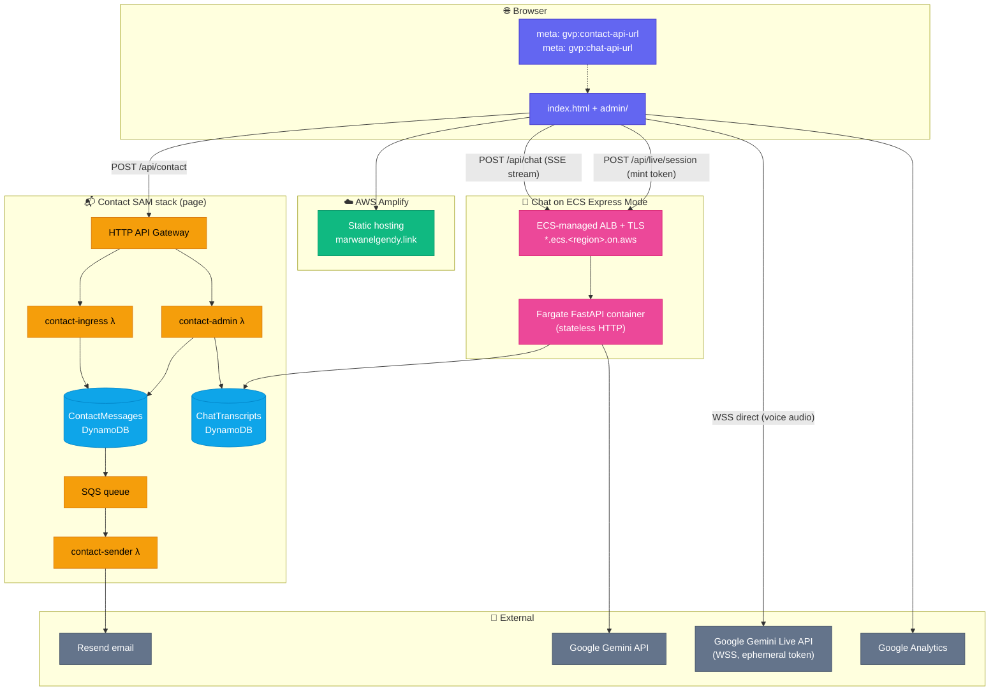
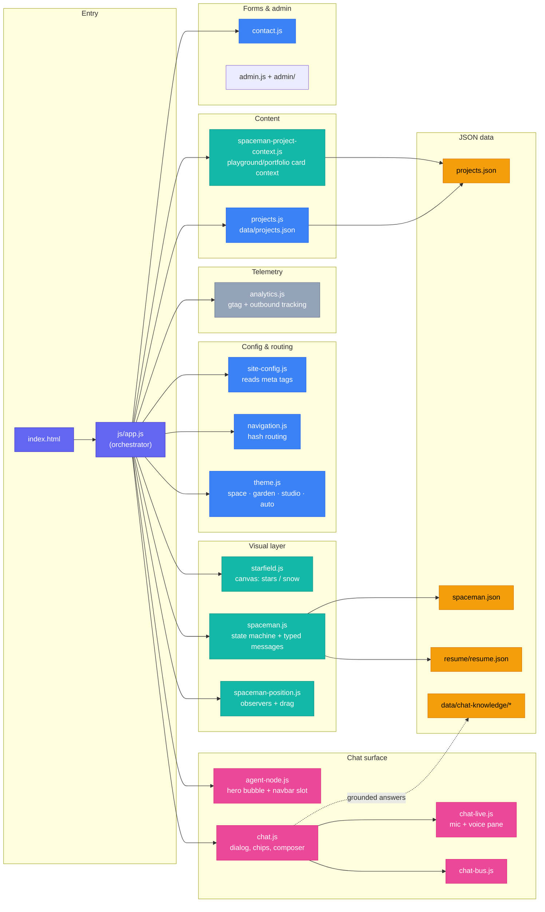
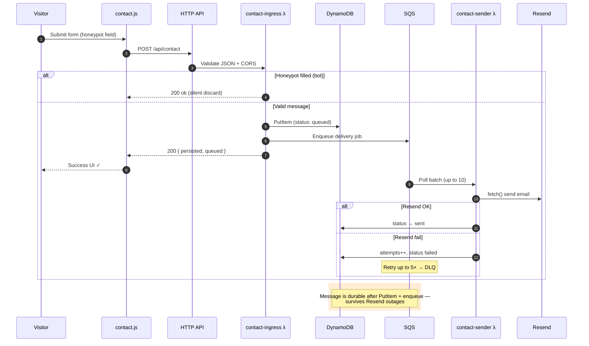
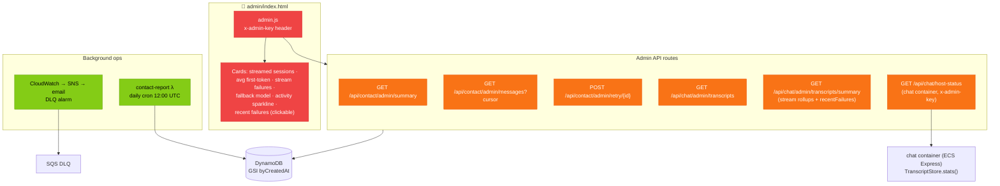
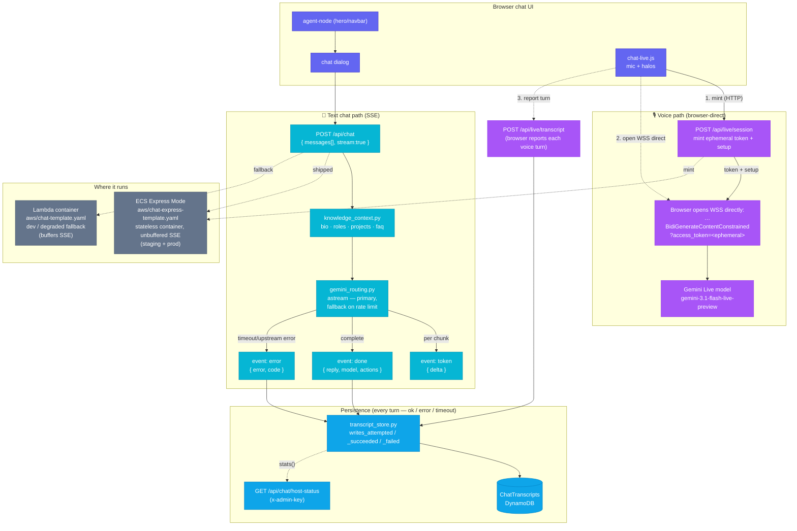
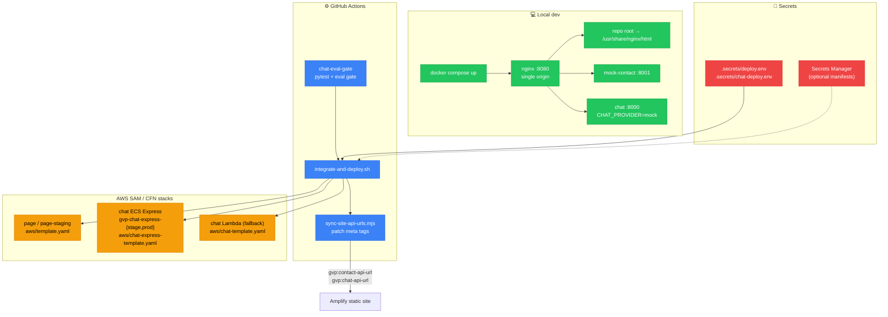
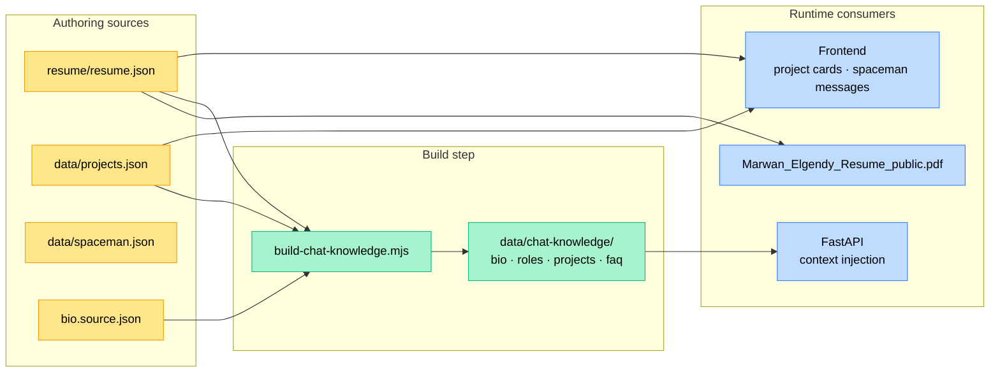

# GVP architecture

Architecture reference for **Marwan Elgendy's portfolio** (`gvp`): a static site on **AWS Amplify**, a durable **contact pipeline** (SAM), and a **Gemini-backed chat API** — a stateless HTTP container on **Amazon ECS Express Mode** for text (SSE), with **browser-direct** voice (the browser connects straight to Google's Gemini Live API using a server-minted ephemeral token; there is no server WebSocket relay).

Diagrams use [Mermaid](https://mermaid.js.org/). They render on GitHub, in many IDEs, and in viewers that support fenced `mermaid` blocks.

**Related docs:** [`README.md`](../README.md) (run/deploy), [`CLAUDE.md`](../CLAUDE.md) (module map), [`docs/production-readiness/`](production-readiness/README.md) (release checklists).

---

## Table of contents

1. [System overview](#1-system-overview)
2. [Frontend (static site)](#2-frontend-static-site)
3. [Contact pipeline](#3-contact-pipeline)
4. [Chat (text + voice)](#4-chat-text--voice)
5. [Deployment topology](#5-deployment-topology)
6. [Data and assets](#6-data-and-assets)
7. [Strengths and constraints](#7-strengths-and-constraints)
8. [Key file map](#8-key-file-map)

---

## 1. System overview

The browser loads static HTML/CSS/JS from Amplify. API base URLs come from `<meta>` tags (patched after deploy by `scripts/sync-site-api-urls.mjs`). Contact and chat admin share one HTTP API on the **contact SAM stack**; chat text (SSE) goes to the **stateless chat container on ECS Express Mode**. Voice is **browser-direct**: the chat container only mints a short-lived Gemini ephemeral token over HTTP (`POST /api/live/session`), and the browser then opens Google's Live WebSocket itself — no traffic relays through the server (ADR-0007).



### Design choice: one stateless chat container + browser-direct voice (ADR-0007)

The chat backend is a single **stateless HTTP** FastAPI container on **Amazon ECS Express Mode** (a Fargate task fronted by an ECS-managed ALB with AWS TLS and autoscaling — "image + port → HTTPS" with no hand-rolled VPC/ALB/listener wiring). It runs in **both staging and prod**. The earlier split (Lambda for text, a hand-rolled ECS+ALB stack for a voice WebSocket relay) was retired by ADR-0007.

| Path | Host | Why |
|------|------|-----|
| **Text** (`POST /api/chat`, SSE) | ECS Express Mode | Streaming HTTP — token-by-token UX needs unbuffered responses, which the managed ALB passes straight through. The Lambda stack (`aws/chat-template.yaml`) is kept only as a dev/degraded fallback (Mangum buffers the SSE generator, so the user sees the full reply at once). |
| **Voice** (`POST /api/live/session` → mint) | ECS Express Mode (HTTP only) | The server only mints a single-use Gemini **ephemeral token** and returns Google's Live WSS URL; the **browser opens that WebSocket directly** to Google. No server WebSocket, no relay — so voice no longer depends on the host being able to upgrade WebSockets. |

Contact admin and chat transcript admin routes live on the **same** contact HTTP API and use the same `x-admin-key` (`ADMIN_API_KEY`). The chat container also exposes a gated diagnostic at `GET /api/chat/host-status` for the admin SPA — same secret, but checked inside the FastAPI app rather than the admin Lambda.

---

## 2. Frontend (static site)

No bundler: ES modules from `js/app.js`, theme via `data-theme` on `<html>`, hash routing (`#home`, `#playground`, `#portfolio`).



### Boot order (`app.js`)

1. `initAnalytics()` — gtag; virtual `page_view` on navigation
2. `bindOutboundTracking()` — `[data-track]` elements
3. `initTheme()` — `localStorage` key `gvp-theme`
4. `initStarfield()` — canvas background
5. `initContactForm()` — contact dialog
6. `initSpaceman()` — character + message cycle from `/data/spaceman.json` + resume merge
7. `initSpacemanPosition()` — layout observers
8. `initChat()` + `initAgentNode()` — hero/navbar chat + full dialog
9. `initNavigation()` — hash routes; hooks spaceman state
10. `loadProjects()` / `renderProjects()` — `data/projects.json`
11. `initSpacemanProjectContext()` — playground/portfolio card context

### Themes

| Preference | Resolved theme | Canvas / scene |
|------------|----------------|----------------|
| `space` | Space | 3D starfield, motion streaks |
| `garden` | Garden | Snow + DOM garden scene (sky, trees, ocean) |
| `studio` | Studio | Paper-like, low distraction |
| `auto` | `space` (dark) or `garden` (light) | Follows `prefers-color-scheme` via `resolveAuto()` in [`js/theme.js`](../js/theme.js) |

### API URL resolution (`site-config.js`)

- `gvp:contact-api-url` → `contactApiUrl` (local fallback: `/api/contact`)
- `gvp:chat-api-url` → `chatApiUrl` (local fallback: `/api/chat`)
- Also exposed as `window.__CONTACT_API_URL__` and `window.__CHAT_API_URL__` for admin

---

## 3. Contact pipeline

**Success** = message persisted in DynamoDB and enqueued before the UI shows success. Delivery is async via SQS + sender Lambda + Resend.

### Submit flow



### SAM resources (`aws/template.yaml`)

| Resource | Role |
|----------|------|
| `ContactApi` | HTTP API, CORS, throttling (stricter on admin routes) |
| `ContactMessagesTable` | Primary store; GSI `byCreatedAt` (`listPk` + `createdAt`) |
| `ChatTranscriptsTable` | Chat logs; same GSI pattern as contact messages |
| `ContactDeliveryQueue` | Async delivery; redrive to DLQ after 5 receives |
| `ContactIngressFunction` | `POST /api/contact` |
| `ContactSenderFunction` | SQS trigger → Resend |
| `ContactFailureReportFunction` | Daily cron → email summary of failures |
| `ContactAdminFunction` | Admin + chat transcript admin routes |
| `ContactDlqAlarm` | SNS → `ALARM_EMAIL` when DLQ has messages |

### Admin surface



**Contact admin routes:** `summary`, `messages` (paginated `?limit` + `?cursor`), `messages/{id}`, `health`, `retry/{id}`, `suppress-report`.

**Chat admin routes (same API):** `transcripts`, `transcripts/{id}`, `note`, `reviewed`, `transcripts/summary`.

**Chat host diagnostic (separate origin):** `GET /api/chat/host-status` on the chat ECS Express container. Returns provider name, configured/primary/fallback/last model ids, prompt version, provider timeout, and live `TranscriptStore` counters (`writes_attempted`, `_succeeded`, `_failed`, `last_error`, `last_success_at`). Gated by `ADMIN_API_KEY` env on the chat container; degrades gracefully when unset (401, panel keeps working off the DDB rollups).

#### Chat transcripts summary payload

The `/api/chat/admin/transcripts/summary` response is what the dashboard renders into cards and the sparkline. Top-level shape:

```json
{
  "tableName": "...", "total": 7, "reviewed": 1, "unreviewed": 6, "flagged": 0,
  "byPromptVersion": { "1.4.0": 7 },
  "byFlag": { "no_retrieval_match": 0, "negative_feedback": 0, ... },
  "voice":  { "sessions": 2, "voiceTurns": 8, "textTurns": 14, "avgTextLatencyMs": 5800, ... },
  "stream": {
    "streamedSessions": 5, "streamedTurns": 12,
    "streamFailures": 2, "streamTimeouts": 1,
    "fallbackTurns": 3,
    "avgFirstTokenLatencyMs": 610, "avgOutputChars": 145,
    "errorsByCode": { "upstream_timeout": 1, "model_error": 1 },
    "recentFailures": [
      { "capturedAt": "...", "errorCode": "upstream_timeout",
        "errorMessage": "...", "status": "timeout", "stream": true,
        "latencyMs": 28000, "sessionId": "..." }
    ]
  },
  "activityByDay": { "YYYY-MM-DD": <count>, ... },
  "activeDays": 30
}
```

`recentFailures` is capped at 20 (newest first); each row is clickable in the panel and jumps to the originating transcript.

---

## 4. Chat (text + voice)

FastAPI app in `docker/chat/app/`, deployed as a stateless container on **ECS Express Mode** (the same image also runs as a Lambda fallback). Knowledge from `data/chat-knowledge/` (built by `scripts/build-chat-knowledge.mjs`). Voice is **browser-direct**: the server mints a Gemini ephemeral token and the browser connects to Google's Live API itself (ADR-0007 Phase 1; `docker/chat/app/live_relay.py` was deleted).



### Streaming behavior

- **Request:** `{ messages, stream: true, sessionId }`. Backwards-compat: `stream: false` returns a single JSON body (used by Lambda fallback and existing callers).
- **Response when `stream:true`:** `text/event-stream` with `Cache-Control: no-cache` and `X-Accel-Buffering: no` so nginx/ALB pass tokens straight through.
- **Routing:** `GeminiRoutingChain.astream` tries the primary model; if the *first* chunk fails with a rate-limit, it transparently retries on the fallback. Once any chunk has flushed, the chain is committed — mid-stream errors propagate as `event: error`.
- **Budget:** single `astream` deadline (`provider_timeout_seconds`, default 28s for Gemini) wrapped with per-chunk `asyncio.wait_for` so the streaming path stays portable to Python 3.10 (`asyncio.timeout` is 3.11+).
- **Failure persistence:** every turn — success, timeout, or upstream error — writes a row before returning. The error variants carry `status`, `errorCode`, `errorMessage`, and any partial reply so the admin panel can see what happened.

### Turn telemetry (DynamoDB `turns[]` entries)

Each `persist_turn` call appends one element to the session's `turns` list. Fields populated for text:

| Field | Type | Meaning |
|-------|------|---------|
| `capturedAt` | ISO-8601 | When the turn was persisted |
| `modality` | `text` / `voice` | Splits the table without sniffing fields |
| `stream` | bool | Was SSE used? |
| `status` | `ok` / `error` / `timeout` | Terminal state of the attempt |
| `firstTokenLatencyMs` | int | Wall-clock to first non-empty delta (streaming only) |
| `streamChunkCount` | int | Number of chunks the chain yielded |
| `latencyMs` | int | Total round-trip the chat host observed |
| `outputCharCount` | int | `len(reply)` — cheap proxy for output tokens |
| `fallbackUsed` | bool | True when the secondary model produced the answer |
| `errorCode` / `errorMessage` | str | Set only on non-`ok` turns (truncated to 400 chars) |
| `toolCalls` / `actions` | list | Surfaced model tool invocations |
| `retrieval` | object | FAQ id + role/project ids the knowledge pack matched |
| `flags` | object | Heuristic flags (`no_retrieval_match`, etc.) |

Voice turns carry `transport`, `audioInBytes`, `audioOutBytes`, `turnDurationMs`, `interrupted`, `intent` instead of the stream fields. Because voice is browser-direct, these are reported by the **browser** after each turn via `POST /api/live/transcript` (`docker/chat/app/main.py:1058`), not written by a server-side relay.

### Models (defaults in SAM)

| Use | Parameter / env | Default |
|-----|-----------------|---------|
| Text primary | `GEMINI_MODEL` | `gemini-3.1-flash-lite` |
| Text fallback | `GEMINI_FALLBACK_MODEL` | `gemma-4-26b-a4b-it` |
| Live voice | `GEMINI_LIVE_MODEL` | `gemini-3.1-flash-live-preview` |
| Live voice override | `CHAT_VOICE_MODEL` | _(empty — when set, overrides `GEMINI_LIVE_MODEL` at runtime)_ |

### Voice behavior (browser-direct — ADR-0007 Phase 1)

- Mic UI is **always** in the frontend (no feature flag).
- **Mint:** `POST /api/live/session` mints a single-use Gemini **ephemeral token** (`~3 min`) and builds the `setup` frame server-side (carrying the `Charon` timbre — preserves ADR-0003). It returns `{ websocketUrl, handshake, model, liveVoiceTransport: "direct_google", … }` where `websocketUrl` is Google's Live WSS (`…BidiGenerateContentConstrained?access_token=<token>`).
- **Connect:** the **browser** opens that WSS directly and forwards `setup` → `clientContent` on open (`js/chat-live.js`). The long-lived `GEMINI_API_KEY` never leaves the server.
- **No server WebSocket:** the relay (`live_relay.py`, `WS /api/live/relay/{id}`, the `CHAT_LIVE_RELAY` flag) was deleted. Voice therefore works regardless of whether the host can upgrade WebSockets.
- **Failure modes:** the mint can return **503** (missing corpus / `GEMINI_API_KEY`) or **504** (mint timeout); voice working end-to-end then depends only on a valid key + reachable Google Live, not on host topology.

### Local Docker (single origin)

`docker compose up` → nginx `:8080` serves static files and proxies:

| Path | Upstream |
|------|----------|
| `/` | Repo root (static) |
| `/api/contact` | `mock-contact:8001` |
| `/api/chat`, `/api/live/*` | `chat:8000` (`CHAT_PROVIDER=mock` by default) |

See [`docker/nginx.conf`](../docker/nginx.conf) for WebSocket upgrade headers on live routes.

---

## 5. Deployment topology



### Deploy environments

| Target | Contact stack | Chat host | Meta sync |
|--------|---------------|-----------|-----------|
| `prod` | `SAM_STACK_NAME` → `page` | ECS Express → `gvp-chat-express-prod` | `CHAT_PROD_CHAT_API_URL`, else the stack's `ServiceUrl` output |
| `stage` | `SAM_STACK_NAME_STAGE` → `page-staging` | ECS Express → `gvp-chat-express-stage` | `CHAT_STAGE_CHAT_API_URL`, else the stack's `ServiceUrl` output |

**Entrypoint:** `bash scripts/integrate-and-deploy.sh [prod|stage]`

**Chat deploy target** (`CHAT_DEPLOY_TARGET=express`, default): deploys `aws/chat-express-template.yaml` as `gvp-chat-express-{stage,prod}` (ECS Express Mode provisions the ALB/TLS/autoscaling on the account default VPC; no manual VPC/subnet/ALB bootstrap). The chat `<meta>` URL is set from the stack's `ServiceUrl` output (a managed `*.ecs.<region>.on.aws` host) unless overridden. Voice needs no special host — it is browser-direct. CI: `gvp-chat-express-stage` in `deploy-staging.yml`, `gvp-chat-express-prod` in `deploy-prod.yml`. _(The old `CHAT_VOICE_ECS_BOOTSTRAP` / hand-rolled ECS+ALB path is retired; some leftover help text in `integrate-and-deploy.sh` still references it — tracked as drift for cleanup.)_

**Secrets:** copy from [`secrets.example/`](../secrets.example/README.md) → `.secrets/deploy.env` (+ optional `chat-deploy.env`). CI uses repository secrets with the same names.

**HTML sync:** `node scripts/sync-site-api-urls.mjs` patches `<meta name="gvp:contact-api-url">` and `<meta name="gvp:chat-api-url">` in `index.html` and `admin/index.html`.

---

## 6. Data and assets



**Site images:** `data/projects.json` references `.webp` / `.jpeg` assets at repo root (e.g. `ibm.webp`, `rpi.jpg`). **Resume link:** `resume/Marwan_Elgendy_Resume_public.pdf`.

---

## 7. Strengths and constraints

### Strengths

1. **Durable contact** — persist before enqueue; async delivery with DLQ and daily failure report.
2. **Durable chat telemetry** — every text turn (success, error, or timeout) writes a row before the user-visible response returns, so failed attempts surface in the admin panel instead of vanishing into ECS logs.
3. **No frontend bundler** — ES modules, fast iteration; meta tags for API URLs.
4. **Lean chat hosting** — one stateless container on ECS Express Mode (managed ALB/TLS/autoscaling, no hand-rolled VPC/ALB); voice is browser-direct, so there is no server WebSocket to host. Lambda kept only as a fallback.
5. **Grounded AI** — answers tied to resume/project knowledge pack, not generic fluff.
6. **Single-origin local dev** — nginx mirrors production CORS and proxy paths on `:8080`.

### Constraints

| Constraint | Impact |
|------------|--------|
| Ephemeral token reaches the browser | Browser-direct voice exposes Google's Live WSS endpoint + the single-use ~3-min token to the client (by design; the long-lived `GEMINI_API_KEY` never transits) |
| Lambda + Mangum buffer SSE (fallback only) | On the Lambda fallback the client sees the full reply at once, not token-by-token; the shipped ECS Express host streams unbuffered |
| No bundler | Must serve over HTTP (`file://` breaks module imports) |
| Shared admin API | Contact + chat transcript admin use same `x-admin-key` |
| Host-status endpoint needs key in chat env | Until `ADMIN_API_KEY` is set on the chat container the diagnostic returns 401; the admin panel just falls back to DDB-only rollups |
| Throttling | HTTP API stage limits (e.g. 5 req/s) on public routes |

### Frontend performance notes

- **Garden snow** uses a pre-rendered radial-gradient sprite in `js/starfield.js`; the snow loop is one `drawImage` per flake (~3–5× cheaper than the previous per-frame `createRadialGradient`).
- **Visual-viewport sync** (mobile garden scene) is RAF-coalesced and skips style writes when nothing changed — see `applyVisualViewportSync` in [`js/app.js`](../js/app.js).
- **Garden trees** rely on trunk box-shadows + color contrast rather than `filter: drop-shadow()` on the foliage triangles (drop-shadow forces a composited layer per element).

---

## 8. Key file map

| Area | Path |
|------|------|
| Site entry | `index.html`, `js/app.js` |
| API config | `js/site-config.js`, meta tags in `index.html` |
| Chat FE | `js/chat.js` (SSE parser `readSseChat`), `js/agent-node.js`, `js/chat-live.js`, `js/chat-bus.js` |
| Contact SAM | `aws/template.yaml`, `aws/src/contact-*.js` |
| Chat ECS Express (shipped) | `aws/chat-express-template.yaml` (`gvp-chat-express-{stage,prod}`) |
| Chat Lambda SAM (fallback) | `aws/chat-template.yaml` |
| Chat app | `docker/chat/app/main.py` (SSE `_chat_stream` + `_persist_text_turn`; `POST /api/live/session` mint at `:916`; `POST /api/live/transcript` at `:1058`), `gemini_routing.py` (`astream` w/ fallback), `live_gemini.py` (ephemeral-token mint + timbre `setup`), `transcript_store.py`, `knowledge_context.py` |
| Deploy | `scripts/integrate-and-deploy.sh`, `scripts/sync-site-api-urls.mjs` |
| Local stack | `docker-compose.yml`, `docker/nginx.conf` |
| Admin UI | `admin/index.html`, `js/admin.js` (renders cards + sparkline + recent failures), `css/admin.css` |
| Admin Lambda | `aws/src/contact-admin.js` (`normalizeChatItem` + `getChatSummary` build the stream rollups) |
| Knowledge build | `scripts/build-chat-knowledge.mjs`, `data/chat-knowledge/` |

---

*Last updated: June 2026 — chat re-homed to ECS Express Mode and voice made browser-direct (ADR-0007 Phases 1/3/4 shipped; the server WebSocket relay + hand-rolled ECS+ALB stack are retired). Earlier: streaming SSE + per-turn telemetry + admin stream-rollups; static hosting on AWS Amplify.*
