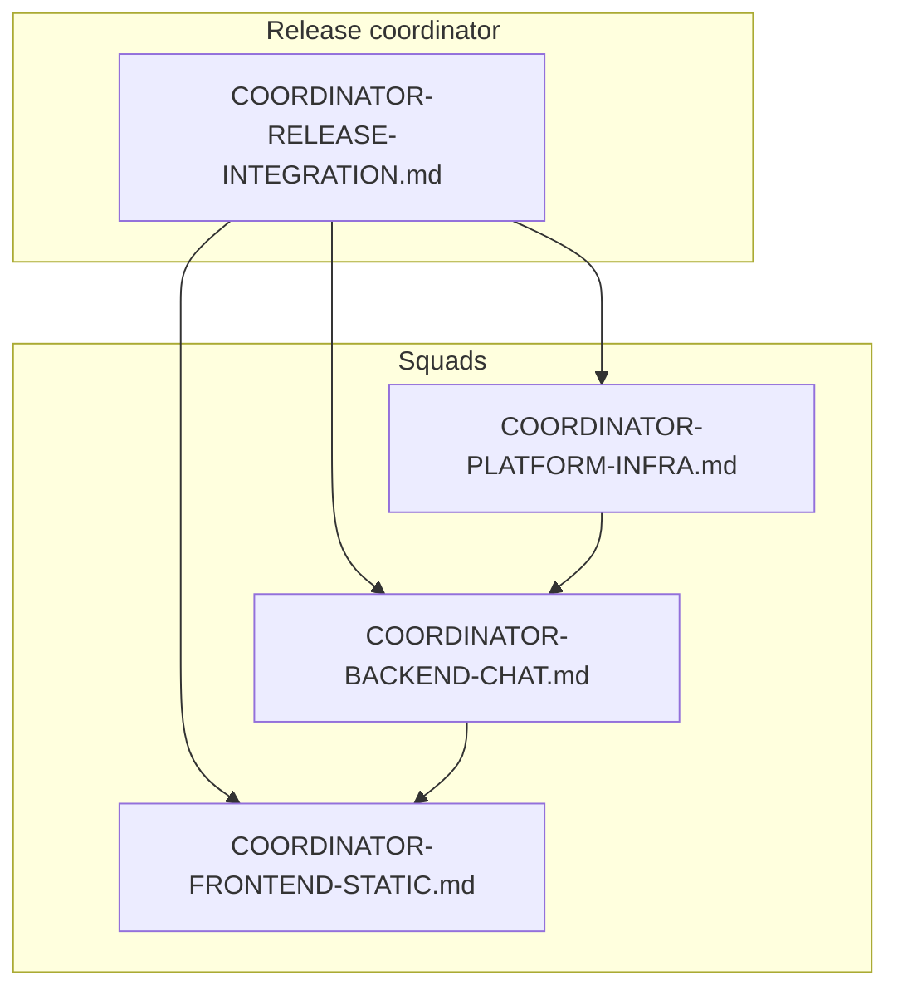

# Production readiness — coordinator-led teams

This folder turns the original parallel build ([`docs/parallel-phases/`](../parallel-phases/README.md)) into **four squads**, each with a **coordinator brief** (scope, plan traceability, worker prompts, sign-off). Use coordinators to assign Cursor agents or humans; each brief ends with a **copy-paste worker prompt**.

Daily execution teams now live in [docs/teams/README.md](../teams/README.md). This `production-readiness` folder remains the final hard gate before release.

**Original plan traceability**

- Parallel execution intent: [`docs/parallel-phases/README.md`](../parallel-phases/README.md) (Docker, Chatbot, UI).
- Docker / smoke / single-origin: [`TEAM_DOCKER.md`](../parallel-phases/TEAM_DOCKER.md).
- LangChain, providers, tests: [`TEAM_CHATBOT.md`](../parallel-phases/TEAM_CHATBOT.md).
- Hero chat, a11y, themes: [`TEAM_UI.md`](../parallel-phases/TEAM_UI.md).

| Coordinator | Owns | Brief |
|---------------|------|--------|
| Platform / Infra | Compose, nginx, images, CI, TLS story | [COORDINATOR-PLATFORM-INFRA.md](./COORDINATOR-PLATFORM-INFRA.md) |
| Backend / Chat | `docker/chat`, secrets, health, limits, tests vs brief | [COORDINATOR-BACKEND-CHAT.md](./COORDINATOR-BACKEND-CHAT.md) |
| Frontend / Static | `index.html`, `js/*`, meta URLs, CDN/proxy, sync scripts | [COORDINATOR-FRONTEND-STATIC.md](./COORDINATOR-FRONTEND-STATIC.md) |
| Release / Integration | Cross-cutting checklist, deploy order, sign-off | [COORDINATOR-RELEASE-INTEGRATION.md](./COORDINATOR-RELEASE-INTEGRATION.md) |

## Dependency order

1. **Chatbot Excellence + Hero UI/UX + Pipeline** start in parallel via [docs/teams/README.md](../teams/README.md).
2. **Testing/QA + Cleanup/Sanity** run continuously and gate merges.
3. **Platform/Edge** and **Backend/Chat coordinator** sign off runtime hardening.
4. **Release/Integration coordinator** executes [RUNBOOK-prod.md](./RUNBOOK-prod.md) for final deployment and rollback readiness.

**How to run a “team” in Cursor**

1. Open the coordinator brief for the squad.
2. Paste the **Worker agent prompt** into a new agent (or split into 2–3 workers per coordinator).
3. Coordinator merges PRs / resolves conflicts between squads (API contract, ports, meta names).

**Pre-audit snapshot (explore agents, condensed)**

- **Platform:** Local stack matches TEAM_DOCKER; prod gaps — TLS, pinned `nginx` tag, compose CI, proxy healthcheck, tighten mock CORS for non-local, honeypot JSON semantics vs brief.
- **Backend:** Contract + mock path solid; prod gaps — `/health` vs readiness when chain is `None`, LLM timeouts, 429 mapping, rate limits, corpus rebuild story, more tests vs TEAM_CHATBOT matrix, multi-worker story if needed.
- **Frontend:** Meta + localhost defaults align with compose; prod gaps — extend `sync-site-api-urls.mjs` (or sibling) for `gvp:chat-api-url`, CDN `/api/chat` proxy or absolute meta, CORS if cross-origin chat, `Content-Type` on contact `fetch`, privacy copy.
