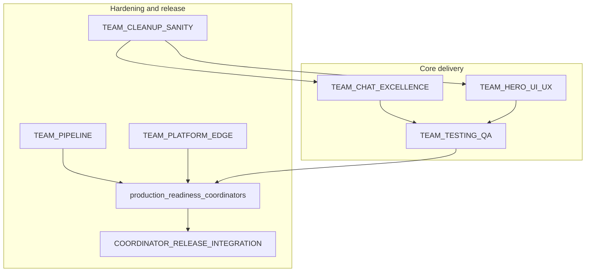

# Teams execution map

This folder organizes execution into focused teams with coordinator ownership. It extends both:

- [docs/parallel-phases/README.md](../parallel-phases/README.md)
- [docs/production-readiness/README.md](../production-readiness/README.md)

| Team | Primary mission | Brief |
|------|------------------|-------|
| Chatbot Excellence (largest) | Correctness + flash-fast latency | [TEAM_CHAT_EXCELLENCE.md](./TEAM_CHAT_EXCELLENCE.md) |
| Hero UI/UX | Hero chat usability, polish, accessibility | [TEAM_HERO_UI_UX.md](./TEAM_HERO_UI_UX.md) |
| Testing/QA | API + UX + integration verification | [TEAM_TESTING_QA.md](./TEAM_TESTING_QA.md) |
| Cleanup/Sanity | Consistency, drift removal, hygiene | [TEAM_CLEANUP_SANITY.md](./TEAM_CLEANUP_SANITY.md) |
| Pipeline | CI/CD automation and deploy glue | [TEAM_PIPELINE.md](./TEAM_PIPELINE.md) |
| Platform/Edge | Runtime topology and edge hardening | [TEAM_PLATFORM_EDGE.md](./TEAM_PLATFORM_EDGE.md) |

## Suggested parallel start

1. Start **Chatbot Excellence** with 4 workers (RAG, prompt, latency, routing).
2. Start **Hero UI/UX** and **Pipeline** in parallel.
3. Start **Testing/QA** after the first chatbot and UI slices merge.
4. Keep **Cleanup/Sanity** running continuously.
5. Run **Production-readiness coordinators** and release gate last.

## Coordinator handoff path

- Working team briefs in this folder drive day-to-day execution.
- Production coordinators remain the hard gate in [docs/production-readiness/](../production-readiness/README.md).
- Final deploy and rollback are controlled by [COORDINATOR-RELEASE-INTEGRATION.md](../production-readiness/COORDINATOR-RELEASE-INTEGRATION.md).
